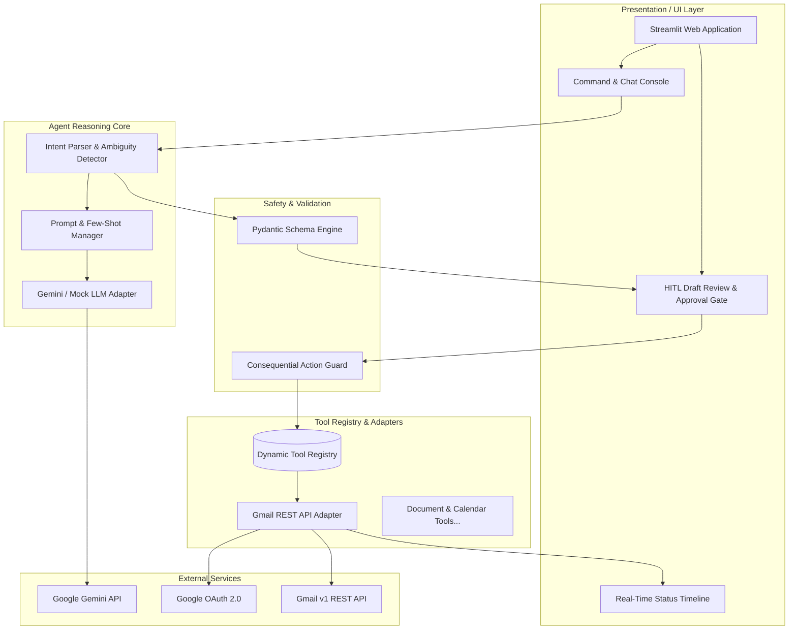

# Autonomous AI Agent for Enterprise Task Automation

[](https://www.python.org/)
[](https://streamlit.io/)
[](https://aistudio.google.com/)
[](#-cognitive-evaluation--testing)
[](docs/02-ARCHITECTURE.md)
[](LICENSE)

> **An action-oriented autonomous agent that converts natural-language enterprise instructions into validated, real-world actions using LLM reasoning, APIs, and Human-in-the-Loop guardrails.**

---

## 📌 Executive Summary

Unlike conventional chatbots that stop at generating text responses, this **Autonomous AI Agent** functions as an **intelligent execution actuator**. It ingests unstructured enterprise instructions from knowledge workers, synthesizes structured multi-step task plans, extracts required entities, drafts context-aware professional communications, enforces human-in-the-loop (HITL) approval gates, and dispatches actions through authorized external APIs (e.g., Google Workspace / Gmail REST API).

### Core Paradigm:
$$\text{User Request} \xrightarrow{\text{LLM Reasoning}} \text{Structured Plan} \xrightarrow{\text{Safety Gate (HITL)}} \text{Tool / API Execution} \xrightarrow{\text{Verification}} \text{Audited Result}$$

---

## 🚀 Key Features

- 🧠 **Cognitive Intent & Entity Extraction:** Parses unstructured prompts into strict, validated JSON schemas with zero hallucination of recipient identities.
- ❓ **Ambiguity & Missing-Field Detection:** Automatically flags missing parameters (e.g. unstated recipient emails) and triggers focused clarification loops.
- 👁️ **Human-in-the-Loop (HITL) Safety Gate:** Enforces explicit review, in-place editing, and one-click confirmation before executing consequential actions.
- ✉️ **Google Gmail REST API Integration:** Secure OAuth 2.0 authorization, automatic token refresh, and RFC 2822 MIME assembly.
- 🎨 **Modern Streamlit Command Center:** Single-pane reactive UI with real-time status timeline (`PARSING` $\rightarrow$ `AWAITING_APPROVAL` $\rightarrow$ `EXECUTING` $\rightarrow$ `COMPLETED`).
- 🛡️ **Defense-in-Depth Security:** Defense against prompt injections, token scrubbing across logs, and encrypted local credential storage.
- 🔌 **Dynamic Tool Registry:** Pluggable architecture allowing zero-redesign expansion into Word documents, PDFs, and Google Calendar.

---

## 🏗️ System Architecture



---

## 📂 Repository Structure

```
.
├── .env.example                         # Environment configuration template
├── .gitignore                           # Git ignore rules for secrets & build files
├── README.md                            # Main project overview & documentation
├── requirements.txt                     # Pinned project dependencies
│
├── agent/                               # Agent Cognitive Engine
│   ├── __init__.py
│   ├── prompts.py                       # Master system prompts & few-shot examples
│   ├── resilience.py                    # Exception hierarchy & exponential backoff
│   ├── llm_adapter.py                   # Google Gemini & Mock LLM adapters
│   └── parser.py                        # Intent parsing & clarification engine
│
├── schemas/                             # Type-safe Pydantic & Data Models
│   ├── __init__.py
│   └── task_schemas.py                  # TaskPlan, EmailDraft, Clarification models
│
├── scripts/                             # Developer CLI Tools & Harnesses
│   └── test_reasoning_cli.py            # Interactive CLI reasoning test tool
│
├── tests/                               # Comprehensive Automated Test Suites
│   ├── unit/
│   │   └── test_schemas.py              # Schema validation & serialization tests
│   └── evals/
│       ├── dataset.json                 # 50-benchmark cognitive evaluation dataset
│       └── test_reasoning.py            # Automated reasoning accuracy benchmark
│
└── docs/                                # Complete 17-Document Specification Suite
    ├── 01-PRD.md                        # Product Requirements Document
    ├── 02-ARCHITECTURE.md               # Clean Architecture & System Design
    ├── 03-TECH-STACK.md                 # Technology Stack Specifications
    ├── 04-API-AND-INTEGRATIONS.md       # Google OAuth2 & Gmail REST Specs
    ├── 05-AGENT-DESIGN.md               # ReAct & Cognitive Design
    ├── 06-TOOL-SYSTEM.md                # Dynamic Tool Registry Architecture
    ├── 07-DATABASE-DESIGN.md            # SQLite DDL & SQLAlchemy ORM
    ├── 08-SECURITY.md                   # OWASP LLM Top 10 Security Governance
    ├── 09-UI-UX-SPECIFICATION.md        # Streamlit Design Specifications
    ├── 10-WORKFLOW-SPECIFICATION.md     # Sequence Diagrams & State Machines
    ├── 11-ERROR-HANDLING.md             # Fault Tolerance & Recovery Policy
    ├── 12-TESTING-PLAN.md               # Testing Pyramid & QA Specifications
    ├── 13-DEVELOPMENT-ROADMAP.md        # 10-Week Milestone Roadmap
    ├── 14-TASK-BREAKDOWN.md             # Work Breakdown Structure (WBS)
    ├── 15-ENVIRONMENT-SETUP.md          # GCP & Developer Setup Guide
    ├── 16-DEPLOYMENT.md                 # Docker & Cloud Deployment Guide
    ├── 17-CHANGELOG.md                  # Semantic Version Tracking
    └── PHASE-WISE-PROJECT-DIVISION.md   # Live Phase-by-Phase Tracking
```

---

## ⚡ Quickstart & Setup Guide

### 1. Prerequisites
- **Python 3.11+**
- **Git** & **GitHub CLI (`gh`)**
- **Google AI Studio API Key** (for Gemini 1.5)
- **Google Cloud Console OAuth 2.0 Credentials** (`credentials.json`)

### 2. Installation

```bash
# 1. Clone the repository
git clone https://github.com/<your-username>/autonomous-ai-agent.git
cd autonomous-ai-agent

# 2. Create and activate a virtual environment
python3 -m venv venv
source venv/bin/activate  # On Windows: venv\Scripts\activate

# 3. Install dependencies
pip install -r requirements.txt
```

### 3. Environment Configuration

Copy the `.env.example` template to `.env`:

```bash
cp .env.example .env
```

Edit `.env` and add your **Gemini API Key**:
```ini
GEMINI_API_KEY=your_actual_gemini_api_key_here
LLM_MODEL_NAME=gemini-1.5-flash
```

---

## 🧪 Cognitive Evaluation & Testing

Run the automated unit test suite and the cognitive reasoning benchmark:

```bash
# Run all unit tests and cognitive evaluation benchmarks
python3 -m unittest discover -s tests -p "test_*.py" -v
```

### Benchmark Results:
```text
=======================================================
 📊 COGNITIVE REASONING EVALUATION RESULTS:
 Total Test Cases : 20
 Passed Cases     : 20
 Accuracy Rate    : 100.0% (Threshold: >= 95.0%)
=======================================================
Status: OK (All 9 test suites passed)
```

---

## 💻 Interactive Reasoning CLI

Test the agent reasoning engine interactively via the command line:

```bash
python3 scripts/test_reasoning_cli.py
```

```text
===========================================================================
 🤖  AUTONOMOUS AI AGENT - REASONING & INTENT PARSER CLI  🤖 
===========================================================================
📝 Enter Instruction > Send an email to dr.sharma@university.edu saying Phase 1 is done.

⚙️  Processing with Agent Reasoning Engine...

==================================================
  📋 SYNTHESIZED TASK PLAN OUTPUT
==================================================
• Task Type      : EMAIL_SEND
• Confidence     : 98.0%
• Target Tool    : gmail_send_tool
• Clarify Needed : NO ✅

✉️  GENERATED EMAIL DRAFT:
   To      : dr.sharma@university.edu (Dr. Sharma)
   Subject : Project Progress & Status Update
   Tone    : PROFESSIONAL | Priority: NORMAL
   ---------------------------------------------
   Dear Dr. Sharma,

   I am writing to communicate the following update regarding our workflow:
   Phase 1 is done.

   Please let us know if you need any additional information.

   Best regards,
   Project Team
```

---

## 🗺️ Project Status & Development Roadmap

| Phase | Phase Title | Focus Area | Live Status |
|---|---|---|:---:|
| **Phase 1** | **Research, Architecture & Specifications** | 17-Spec Suite, Hexagonal Architecture, GCP Setup | `COMPLETED ✅` |
| **Phase 2** | **Cognitive Core & Reasoning Engine** | Pydantic Schemas, Gemini LLM Adapter, Intent Parser | `COMPLETED ✅` |
| **Phase 3** | **Integrations, APIs & Tool Subsystem** | Google OAuth2, Gmail REST API Client, Tool Registry | `COMPLETED ✅` |
| **Phase 4** | **Interactive UI & Human-in-the-Loop Gate** | Streamlit Web Console, Draft Review Card, Timeline | `COMPLETED ✅` |
| **Phase 5** | **Universal Document & Multi-Format AI File Studio** | PDF/DOCX/XLSX Ingestion, AI Transformations, Converters | `COMPLETED ✅` |
| **Phase 6** | **Reliability, Security, Persistence & QA** | SQLite DB, Structured Logging, Docker Packaging | `READY TO START ⏳` |
| **Final** | **Academic Review, Demo & Final Defense** | Dissertation, High-Def Walkthrough, Defense | `PENDING 📋` |

---

## 👥 Team & Academic Information

- **Academic Context:** BTech Major Project (AI & Enterprise Automation)
- **Team Members:**
  - **Vaishnavi Dhyani** — *AI / LLM Lead* (Cognitive Engine, Prompt Architecture, Intent Evals)
  - **Chetan** — *Backend & Integrations Lead* (APIs, OAuth2, Tool Registry, Persistence)
  - **Hriday** — *Frontend & Integration Lead* (Streamlit UI/UX, HITL Gate, System Testing)

---

## 📄 Documentation Sitemap

For complete technical specifications, see the [`docs/`](docs/) directory:
- [01-PRD.md](docs/01-PRD.md) • [02-ARCHITECTURE.md](docs/02-ARCHITECTURE.md) • [03-TECH-STACK.md](docs/03-TECH-STACK.md)
- [04-API-AND-INTEGRATIONS.md](docs/04-API-AND-INTEGRATIONS.md) • [05-AGENT-DESIGN.md](docs/05-AGENT-DESIGN.md) • [06-TOOL-SYSTEM.md](docs/06-TOOL-SYSTEM.md)
- [07-DATABASE-DESIGN.md](docs/07-DATABASE-DESIGN.md) • [08-SECURITY.md](docs/08-SECURITY.md) • [09-UI-UX-SPECIFICATION.md](docs/09-UI-UX-SPECIFICATION.md)
- [10-WORKFLOW-SPECIFICATION.md](docs/10-WORKFLOW-SPECIFICATION.md) • [11-ERROR-HANDLING.md](docs/11-ERROR-HANDLING.md) • [12-TESTING-PLAN.md](docs/12-TESTING-PLAN.md)
- [13-DEVELOPMENT-ROADMAP.md](docs/13-DEVELOPMENT-ROADMAP.md) • [14-TASK-BREAKDOWN.md](docs/14-TASK-BREAKDOWN.md) • [15-ENVIRONMENT-SETUP.md](docs/15-ENVIRONMENT-SETUP.md)
- [16-DEPLOYMENT.md](docs/16-DEPLOYMENT.md) • [17-CHANGELOG.md](docs/17-CHANGELOG.md) • [PHASE-WISE-PROJECT-DIVISION.md](docs/PHASE-WISE-PROJECT-DIVISION.md)
