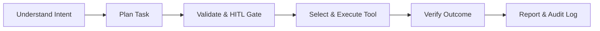

# Product Requirements Document (PRD)
## Autonomous AI Agent for Enterprise Task Automation

**Document Version:** 1.0.0  
**Project Status:** Active Development  
**Academic Context:** BTech Major Project (AI & Enterprise Automation)  
**Team Members:** Vaishnavi Dhyani, Chetan, Hriday  
**Last Updated:** August 2026  

---

## 1. Executive Summary

Modern enterprise operations require knowledge workers to navigate multiple disjointed digital tools to perform routine, repetitive workflows—such as reading updates, composing context-specific emails, scheduling events, aggregating reports, and managing documents. While modern conversational Large Language Models (LLMs) excel at dialogue and text generation, conversational interfaces alone do not execute tasks.

The **Autonomous AI Agent for Enterprise Task Automation** is an action-oriented agentic platform designed to bridge the chasm between natural-language understanding and real-world task execution. The system ingests high-level, unstructured natural-language requests from users, constructs validated multi-step execution plans, dynamically selects and invokes authorized external tools/APIs, enforces human-in-the-loop (HITL) approval gates for consequential actions, and provides deterministic verification and auditing.

The initial **Minimum Viable Product (MVP)** implements an end-to-end intelligent email automation pipeline utilizing LLM reasoning and the Google Gmail REST API. The underlying architecture is engineered with a modular, pluggable tool registry enabling zero-redesign expansion into document processing, calendar management, and multi-service workflows.

---

## 2. Problem Statement & Market Need

### 2.1 The Productivity Paradox in Enterprise Workflows
- **Fragmented Context Switching:** Employees spend up to 28% of their work week reading and answering emails and another 20% searching for internal information or context across apps.
- **Cognitive Overhead:** Drafting context-aware communications, formatting updates, and verifying recipients requires manual effort that detracts from core strategic tasks.
- **Chatbot Limitations:** Standard chat interfaces (e.g., ChatGPT, basic web bots) stop at text generation. The user is still left with the manual burden of copying, navigating to the target app, pasting, formatting, and sending.

### 2.2 Solution Statement
An intelligent, sovereign, and secure agentic layer that converts natural language intent into deterministic, validated API actions with explicit human oversight, enterprise-grade safety guardrails, and audit logging.

---

## 3. Product Vision & Core Paradigm

### 3.1 Vision Statement
To build a scalable, privacy-conscious enterprise AI assistant that functions as an intelligent execution layer between knowledge workers and enterprise digital ecosystems.

### 3.2 Core Operating Principle



$$\text{User Request} \xrightarrow{\text{LLM Reasoning}} \text{Structured Plan} \xrightarrow{\text{Safety Guard}} \text{API Tool} \xrightarrow{\text{Verification}} \text{Audited Result}$$

---

## 4. Target Personas & Use Cases

| Persona | Role / Profile | Pain Point | Target Agent Use Case |
|---|---|---|---|
| **Enterprise Professional** | Product Manager / Consultant | Swamped with repetitive status updates and follow-ups. | "Send an update to the engineering lead that Phase 1 testing is done and request sign-off." |
| **Team Lead / Project Guide** | Academic Guide / Manager | Spends hours sending repetitive reminders and announcements. | "Email all project team members reminding them about tomorrow's 10 AM review." |
| **Operations Associate** | Administrative Staff | Manual data entry across spreadsheets and email clients. | "Extract monthly report highlights and email a structured summary to the client." |
| **Academic / Student** | Research Student | Needs standardized communication with faculty and collaborators. | "Draft and send a formal leave request to the professor for Aug 28th." |

---

## 5. System Scope

### 5.1 In-Scope (MVP Release - Version 1.0)
- **Natural Language Parsing:** Ingestion of single-turn and multi-turn enterprise instructions.
- **Intent Extraction & Parameter Mapping:** Identification of recipient, intent, subject, tone, body, and constraints.
- **Interactive Human-in-the-Loop (HITL) Gate:** Interactive preview, editing, and explicit one-click confirmation before execution.
- **Gmail REST API Integration:** Secure OAuth2 authorization, token lifecycle management, RFC 2822 MIME generation, and dispatch.
- **Streamlit Enterprise UI:** Modern, responsive UI with real-time execution status timeline, interactive draft editor, and log viewer.
- **Execution & Audit Telemetry:** Structured JSON/SQLite execution records with error tracking and security sanitation.
- **Pluggable Tool Architecture:** Standardized tool interface allowing straightforward addition of subsequent tools.

### 5.2 Future Scope (Roadmap V1 - V4)
- **V1 (Document Operations):** Word document (.docx) generation, templating, and automated editing.
- **V2 (PDF & Intelligence):** Document Q&A, PDF generation, invoice and report data extraction.
- **V3 (Calendar & Scheduling):** Google Calendar / Outlook integration, automated meeting scheduling with conflict resolution.
- **V4 (Enterprise Multi-Agent):** Multi-step autonomous chains across Slack, Jira, ERPs, Role-Based Access Control (RBAC), and analytics dashboards.

### 5.3 Out-of-Scope (All Versions)
- Unmonitored, completely autonomous financial transactions or banking operations.
- Destructive file deletion or account configuration changes without multi-factor authorization.
- Bypassing OAuth security boundaries or scraping user credentials.

---

## 6. Functional Requirements (FR)

| Req ID | Requirement Title | Detailed Specification | Priority |
|---|---|---|---|
| **FR-01** | Natural Language Ingestion | System shall accept free-form natural language text instructions through a dedicated UI input console. | Must (P0) |
| **FR-02** | Intent & Entity Extraction | System shall extract intent, recipient entities, subject keywords, tone, and action parameters using structured LLM schemas. | Must (P0) |
| **FR-03** | Task Plan Synthesis | System shall synthesize a structured JSON `TaskPlan` defining required actions, target tools, and parameter values. | Must (P0) |
| **FR-04** | Ambiguity & Missing Field Detection | System shall detect missing parameters (e.g., missing recipient email) and prompt the user with focused clarification questions. | Must (P0) |
| **FR-05** | Professional Content Drafting | System shall draft professional, context-appropriate, and grammatically accurate email content matching the intended tone. | Must (P0) |
| **FR-06** | Human-in-the-Loop (HITL) Gate | System shall present the synthesized email draft (recipient, subject, body) in an editable preview and require explicit user approval. | Must (P0) |
| **FR-07** | Secure Gmail Dispatch | System shall execute the send operation via Google Gmail REST API using valid OAuth 2.0 user tokens. | Must (P0) |
| **FR-08** | Real-Time Execution Tracking | System shall transition and display discrete execution states (`PLANNED`, `AWAITING_CONFIRMATION`, `EXECUTING`, `COMPLETED`, `FAILED`). | Must (P0) |
| **FR-09** | Deterministic Error Handling | System shall catch API timeouts, rate limits, invalid email addresses, and auth failures, presenting clear recovery actions. | Must (P0) |
| **FR-10** | Comprehensive Audit Logging | System shall log all workflow executions, parameters (sanitized of PII/tokens), timestamps, and API response IDs. | Must (P0) |
| **FR-11** | Extensible Tool Registry | System shall implement a dynamic tool registry allowing registration and execution of external tools via unified interfaces. | Must (P0) |
| **FR-12** | Local Credential & State Persistence | System shall persist user session states, execution history, and refresh tokens locally and securely. | Should (P1) |

---

## 7. Non-Functional Requirements (NFR)

| Req ID | Category | Requirement Specification |
|---|---|---|
| **NFR-01** | **Performance & Latency** | End-to-end intent extraction and draft generation shall complete within $\le 3.5$ seconds under standard network conditions. API execution shall complete within $\le 2.0$ seconds. |
| **NFR-02** | **Security & Credential Safety** | Zero hard-coded credentials. All API keys and client secrets stored via `.env`. OAuth access/refresh tokens stored encrypted or restricted to local user environment. |
| **NFR-03** | **Reliability & Truthfulness** | The system shall never report a task as completed unless a valid `200 OK` / message ID confirmation is returned by the target API. |
| **NFR-04** | **Maintainability & Modularity** | Clean separation of concerns across UI, Agent Core, Tool Registry, API Adapters, and Storage layers. Strict typing with Pydantic v2. |
| **NFR-05** | **Usability & Human Ergonomics** | Intuitive single-screen workflow requiring zero technical or programming knowledge from the end-user. |
| **NFR-06** | **Observability & Traceability** | Every task execution is tagged with a unique UUID (`task_id`) traceable across application logs, database records, and UI views. |
| **NFR-07** | **Data Privacy** | Zero data persistence on third-party servers beyond necessary LLM API calls. LLM prompts stripped of sensitive local secrets. |
| **NFR-08** | **Cross-Platform Compatibility** | Fully functional across Linux, macOS, and Windows environments on Python 3.11+. |

---

## 8. MVP Acceptance Criteria Checklist

- [ ] **AC-01:** System ingests natural language prompts (e.g., *"Send project update to chetan@example.com saying phase 1 is done"*).
- [ ] **AC-02:** System extracts parameters accurately without hallucinating recipients.
- [ ] **AC-03:** Professional, well-structured email draft generated.
- [ ] **AC-04:** UI presents interactive preview card with editable recipient, subject, and body fields.
- [ ] **AC-05:** Consequential action blocked until user clicks **Approve & Send**.
- [ ] **AC-06:** OAuth 2.0 flow securely authenticates user Gmail account and caches tokens.
- [ ] **AC-07:** Gmail API sends message and returns verified Gmail Message ID.
- [ ] **AC-08:** UI updates status to `COMPLETED` and displays verified dispatch timestamp and ID.
- [ ] **AC-09:** Simulated network failures or invalid email formats produce structured error alerts with retry options.
- [ ] **AC-10:** Execution metadata recorded in SQLite database and structured log files.

---

## 9. Key Project Differentiator

Unlike conversational chatbots that produce static text answers, this agent operates as an **Autonomous Actuator**:

```
Traditional Chatbot:  User -> Prompt -> LLM -> Text Response (Manual User Action Required)
Proposed AI Agent:    User -> Instruction -> Reasoning Engine -> Structured Plan -> 
                      Safety Gate (HITL) -> Authorized Tool Execution -> Verification -> Complete
```
