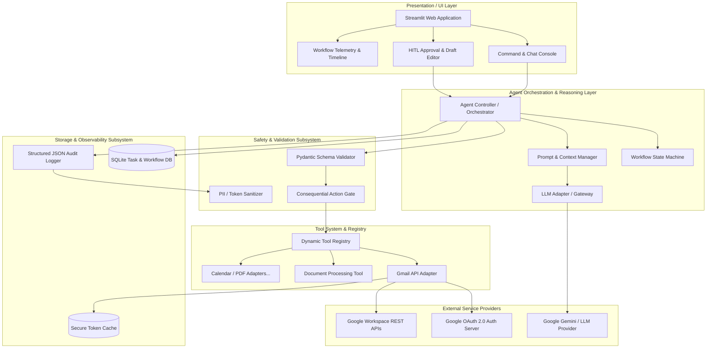
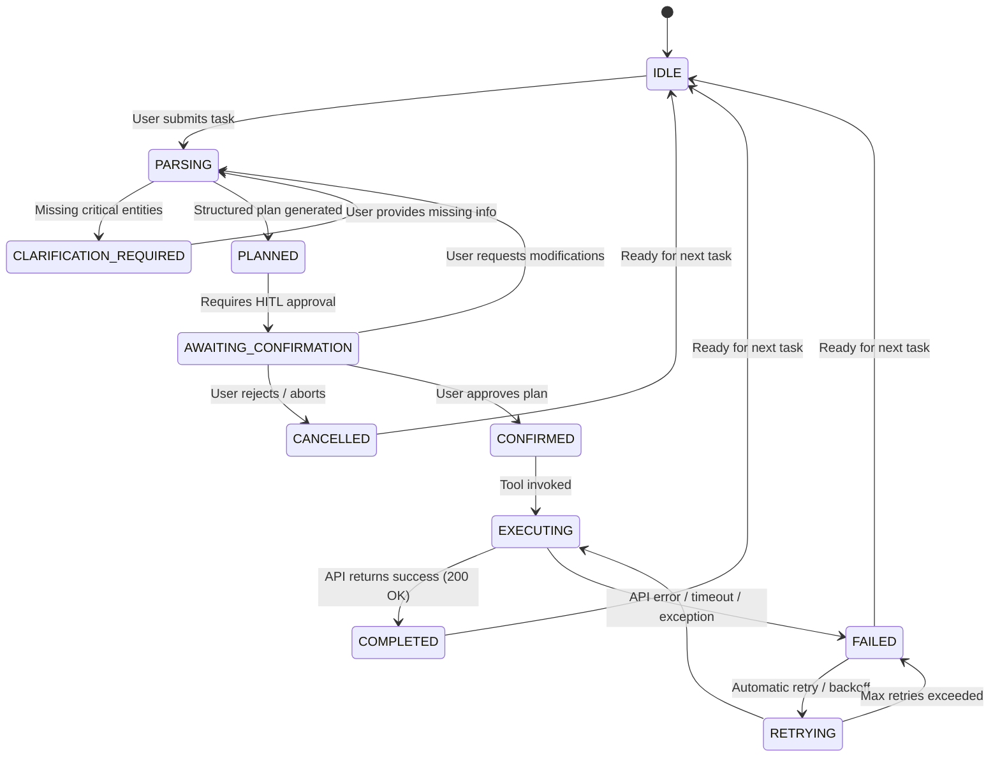

# System Architecture Specification
## Autonomous AI Agent for Enterprise Task Automation

**Document Version:** 1.0.0  
**Status:** Approved Architecture  
**Target System:** Python 3.11+ / Streamlit / Google Workspace Ecosystem  

---

## 1. Architectural Philosophy & Principles

The system is designed around the **Clean Hexagonal Architecture** (Ports and Adapters) combined with an **Action-Oriented ReAct Loop** with strict **Human-in-the-Loop (HITL) Safety Gates**.

### Core Tenets:
1. **Decoupled Reasoning & Execution:** The reasoning layer (LLM) never directly touches external API sockets. It emits structured JSON intents that are validated deterministically by application code.
2. **Explicit Verification Boundaries:** No external state mutation (such as sending an email or writing a file) occurs without passing through parameter validation and human authorization.
3. **Pluggable Tool Registry (Open-Closed Principle):** New tools (Docs, Sheets, Calendar, PDFs) can be registered into the runtime without modifying the core agent orchestration engine.
4. **State Traceability:** Every workflow execution operates as a finite state machine (FSM) where all transitions are immutable and logged.

---

## 2. High-Level Architecture Diagram



---

## 3. Subsystem Breakdown

### 3.1 Presentation Layer (Streamlit Frontend)
- **Role:** Delivers a zero-friction UI for conversational task intake, rich draft editing, status tracking, and audit visualization.
- **Key Modules:**
  - `components/chat_console.py`: Handles multi-turn natural language input and clarification questions.
  - `components/draft_preview.py`: Interactive form allowing manual edits to recipient, subject, and body before execution.
  - `components/timeline.py`: Visual state indicator rendering real-time step progressions (`IDLE` $\rightarrow$ `PARSING` $\rightarrow$ `AWAITING_APPROVAL` $\rightarrow$ `EXECUTING` $\rightarrow$ `COMPLETED`).
  - `components/history_viewer.py`: Table and detailed view of past task executions, logs, and statuses.

### 3.2 Agent Orchestrator & State Machine
- **Role:** Coordinates the lifecycle of a task from initial prompt ingestion to final outcome reporting.
- **Key Modules:**
  - `agent/orchestrator.py`: Coordinates intent parsing, validation, tool invocation, and error handling.
  - `agent/state_machine.py`: Deterministic FSM enforcing valid state transitions and preventing out-of-order execution.
  - `agent/prompt_manager.py`: Formats dynamic prompts injecting tool definitions, user instructions, and formatting constraints.

### 3.3 Safety, Validation & Guardrails
- **Role:** Ensures data integrity, prevents hallucinations from reaching production APIs, and enforces human sign-off.
- **Key Modules:**
  - `schemas/task_schemas.py`: Pydantic models for `TaskPlan`, `EmailDraft`, `ToolResult`, and `ClarificationRequest`.
  - `security/sanitizer.py`: Strips OAuth tokens, passwords, and private API keys before writing to application logs.
  - `security/action_guard.py`: Classifies tools into `READ_ONLY` (safe for auto-execution) vs `CONSEQUENTIAL` (requires explicit user confirmation).

### 3.4 Tool Execution Engine
- **Role:** Dispatches validated parameters to external adapters using a uniform abstract interface.
- **Key Modules:**
  - `tools/base.py`: Defines the `BaseTool` abstract base class.
  - `tools/registry.py`: Registry singleton that loads, lists, and executes registered tools.
  - `tools/gmail/`: Concrete adapter encapsulating OAuth token retrieval, MIME assembly, and REST communication.

### 3.5 Storage & Observability Subsystem
- **Role:** Records all operational metrics, workflow steps, and execution artifacts for accountability.
- **Key Modules:**
  - `db/database.py`: SQLAlchemy engine managing SQLite connection pools.
  - `db/models.py`: Database tables (`TaskRecord`, `WorkflowStep`, `AuditLog`).
  - `logging/logger.py`: Configures structured rotating JSON logging.

---

## 4. Workflow Finite State Machine (FSM)

The lifecycle of every user task is strictly governed by the following state transitions:



### State Definitions:
| State | Description | Invariants & Guards |
|---|---|---|
| `IDLE` | Waiting for user command. | No active execution thread. |
| `PARSING` | LLM reasoning over input & parameter extraction. | Raw prompt validated against length constraints. |
| `CLARIFICATION_REQUIRED` | Missing required parameters (e.g. no recipient email). | Execution paused; prompt sent to user. |
| `PLANNED` | Valid `TaskPlan` object created. | Pydantic validation passes 100%. |
| `AWAITING_CONFIRMATION` | Draft presented to user for review. | External API execution blocked. |
| `CONFIRMED` | User signed off on execution. | Timestamp and user signature captured. |
| `EXECUTING` | Tool adapter communicating with external API. | Timeout timers active (default 10s). |
| `COMPLETED` | External service confirmed action. | API Message ID recorded in DB. |
| `FAILED` | Exception occurred during pipeline. | Sanitized error saved to DB; user alerted. |
| `CANCELLED` | User deliberately rejected execution. | Task terminated cleanly without API calls. |

---

## 5. Modularity & Tool Extension Architecture

The tool layer implements the **Strategy Pattern** via a centralized registry:

```python
class BaseTool(ABC):
    """Abstract Base Class for all Enterprise Automation Tools."""
    
    @property
    @abstractmethod
    def metadata(self) -> ToolMetadata:
        """Returns tool name, description, schema, and safety level."""
        pass

    @abstractmethod
    def validate_params(self, params: dict) -> bool:
        """Validates incoming parameters against Pydantic schema."""
        pass

    @abstractmethod
    def execute(self, params: dict) -> ToolResult:
        """Executes the external API operation and returns a standardized ToolResult."""
        pass
```

Adding a new capability (e.g., Google Calendar Scheduling) requires only:
1. Creating `tools/calendar/calendar_tool.py` implementing `BaseTool`.
2. Registering it with `@ToolRegistry.register`.
3. The LLM Prompt Manager automatically discovers the tool and exposes its capabilities to the reasoning engine.

---

## 6. Concurrency, Execution & Lifecycle Model

- **Session Isolation:** Streamlit sessions maintain independent `st.session_state` containers, ensuring zero state contamination between browser tabs or users.
- **Asynchronous Execution:** I/O operations (LLM generation, Google REST API calls) are non-blocking or executed via structured background handlers.
- **Fail-Safe Recovery:** If an API call fails or times out, the state machine rolls back cleanly without leaving hanging locks or corrupting DB state.
