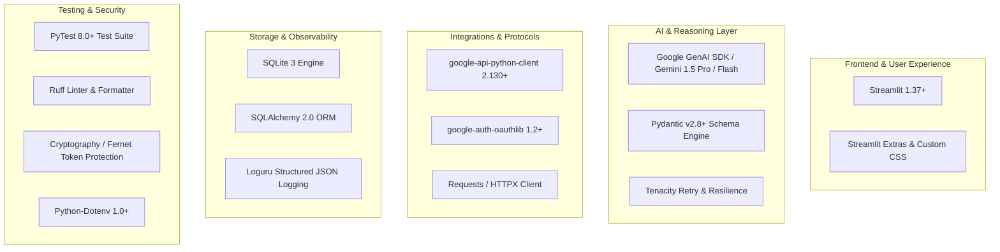

# Technology Stack & Dependency Specification
## Autonomous AI Agent for Enterprise Task Automation

**Document Version:** 1.0.0  
**Status:** Approved  
**Language Runtime:** Python 3.11+  

---

## 1. Overview & Selection Rationale

The technology stack is selected to maximize **modularity, developer velocity, type safety, deterministic API execution, and ease of deployment** for an enterprise-focused academic project.



---

## 2. Layer-by-Layer Technology Breakdown

### 2.1 Core Runtime & Environment
- **Python 3.11.x**: Optimal performance, robust typing enhancements (`typing.Self`, `dataclass_transform`), and strong ecosystem support for AI and Google APIs.
- **Virtual Environment**: Standard `venv` / `conda` for deterministic dependency isolation.

### 2.2 Artificial Intelligence & LLM Layer
| Component | Technology | Rationale |
|---|---|---|
| **Primary LLM Provider** | Google Gemini 1.5 Flash / Pro (`google-genai` / `google-generativeai`) | High context window, native structured JSON output capability, fast inference latency ($\approx 1.2s$), and cost efficiency. |
| **Secondary/Fallback LLM** | OpenAI API (`openai` SDK / `gpt-4o-mini`) | Compatibility layer if alternative LLM providers or local Ollama instances are configured. |
| **Prompt & Output Validation** | Pydantic v2 (`pydantic >= 2.8.0`) | Strict typing, runtime schema validation, automatic JSON schema export, and instant deserialization. |
| **Retry & Resilience** | `tenacity >= 8.5.0` | Exponential backoff, jitter, and automatic retry policies on rate-limit (429) or transient server errors (503). |

### 2.3 Frontend & Human-in-the-Loop (HITL) UI
| Component | Technology | Rationale |
|---|---|---|
| **Web Framework** | Streamlit (`streamlit >= 1.37.0`) | Instant rapid reactive UI development, native session state management, seamless Python-native component rendering. |
| **Styling & Components** | Streamlit Extras + Custom Scoped CSS | Clean modern enterprise card layouts, color-coded status badges, and timeline indicators. |

### 2.4 Google Workspace & External Integrations
| Component | Technology | Rationale |
|---|---|---|
| **Gmail REST API Client** | `google-api-python-client >= 2.138.0` | Official Google API client library for sending, drafting, and reading Gmail messages. |
| **Authentication Flow** | `google-auth-oauthlib >= 1.2.1`, `google-auth-httplib2 >= 0.2.0` | Industry-standard OAuth 2.0 Installed App / Web authorization flow with automated token refreshing. |
| **MIME & Message Assembly** | Standard Library (`email.message.EmailMessage`, `base64`) | Zero-dependency, RFC 2822 compliant email body and multipart attachment formatting. |

### 2.5 Persistence & Audit Logging
| Component | Technology | Rationale |
|---|---|---|
| **Database Engine** | SQLite 3 (Embedded) | Zero configuration, ACID-compliant, file-based persistence for task logs, user configurations, and audit trails. |
| **ORM & Query Layer** | SQLAlchemy (`sqlalchemy >= 2.0.30`) | Strong typing, query builder, schema migrations, and seamless future migration to PostgreSQL if required. |
| **Structured Logging** | `loguru >= 0.7.2` | Clean JSON logging with rotation, contextual binding (`task_id`), colored console output, and easy log filtering. |

### 2.6 Security, Secrets & Testing
| Component | Technology | Rationale |
|---|---|---|
| **Secret Management** | `python-dotenv >= 1.0.1` | Prevents secrets from being hard-coded in source code; loads environment variables at startup. |
| **Token Encryption** | `cryptography >= 43.0.0` | Fernet symmetric encryption for stored OAuth token files on disk. |
| **Test Framework** | `pytest >= 8.3.0`, `pytest-mock >= 3.14.0`, `pytest-asyncio` | Fast, robust unit and integration testing with complete mocking of LLM and Gmail API responses. |
| **Static Analysis** | `ruff >= 0.5.0`, `mypy >= 1.11.0` | Ultra-fast linting, formatting, and strict type checking. |

---

## 3. Detailed `requirements.txt` Specification

The project's dependency manifest is structured as follows:

```text
# --- Core AI & LLM ---
google-generativeai>=0.7.2
google-genai>=0.1.1
openai>=1.40.0
pydantic>=2.8.2
tenacity>=8.5.0

# --- Google Workspace & API Clients ---
google-api-python-client>=2.138.0
google-auth-oauthlib>=1.2.1
google-auth-httplib2>=0.2.0
requests>=2.32.3
httpx>=0.27.0

# --- Frontend & UI ---
streamlit>=1.37.1
streamlit-extras>=0.4.3

# --- Persistence & Database ---
sqlalchemy>=2.0.31

# --- Security & Utilities ---
python-dotenv>=1.0.1
cryptography>=43.0.0
loguru>=0.7.2
python-dateutil>=2.9.0

# --- Testing & Quality Assurance (Dev) ---
pytest>=8.3.2
pytest-mock>=3.14.0
pytest-cov>=5.0.0
ruff>=0.5.5
mypy>=1.11.1
```

---

## 4. `pyproject.toml` Configuration Spec

```toml
[build-system]
requires = ["setuptools>=68.0", "wheel"]
build-backend = "setuptools.build_meta"

[project]
name = "autonomous-ai-agent"
version = "1.0.0"
description = "Autonomous AI Agent for Enterprise Task Automation"
authors = [
    { name = "Vaishnavi Dhyani" },
    { name = "Chetan" },
    { name = "Hriday" }
]
requires-python = ">=3.11"
dependencies = [
    "google-generativeai>=0.7.2",
    "pydantic>=2.8.2",
    "google-api-python-client>=2.138.0",
    "google-auth-oauthlib>=1.2.1",
    "streamlit>=1.37.1",
    "sqlalchemy>=2.0.31",
    "python-dotenv>=1.0.1",
    "loguru>=0.7.2"
]

[tool.ruff]
line-length = 100
target-version = "py311"

[tool.ruff.lint]
select = ["E", "F", "I", "N", "W", "UP"]
ignore = ["E501"]

[tool.mypy]
python_version = "3.11"
strict = true
ignore_missing_imports = true
```
