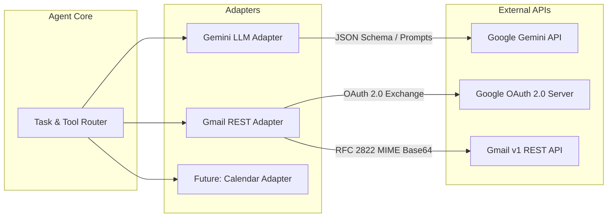
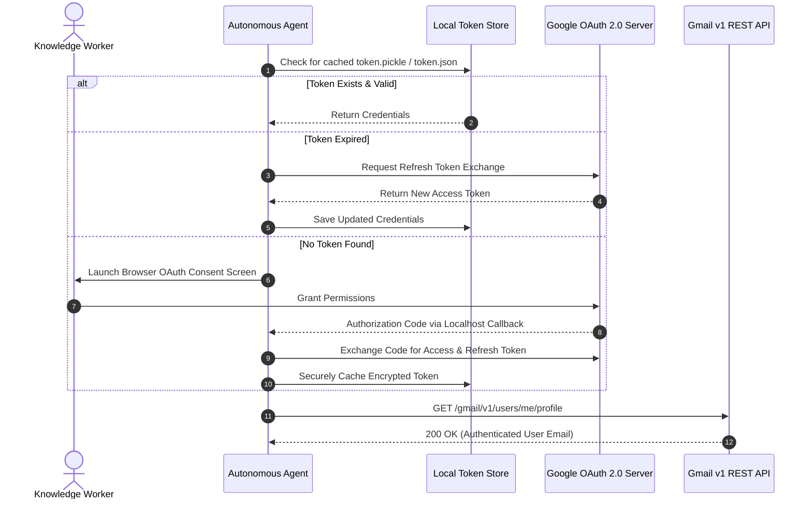

# API & Integration Specification
## Autonomous AI Agent for Enterprise Task Automation

**Document Version:** 1.0.0  
**Status:** Approved  
**Protocols:** REST / JSON / OAuth 2.0 / RFC 2822 MIME  

---

## 1. Integration Architecture Overview

The system acts as an autonomous mediation layer interfacing between AI inference APIs and external enterprise service providers. Every integration adheres to a strict contract:
1. **Isolated Adapters:** All external communications are isolated inside dedicated client modules.
2. **Deterministic Typing:** Inbound and outbound payloads are validated using Pydantic models.
3. **Resilience Engineering:** Built-in rate limiting, exponential backoff, and circuit breaking.



---

## 2. LLM Inference API Specification

### 2.1 Provider Configuration
- **Model:** `gemini-1.5-flash` (Primary), `gemini-1.5-pro` (Complex Multi-step Reasoning)
- **Temperature:** `0.2` (Low temperature to minimize hallucinations and maximize schema fidelity)
- **Top-P:** `0.95`
- **Output Mode:** Native Structured JSON (`response_mime_type="application/json"`)

### 2.2 Inbound Prompt Contract & Schema Enforcement

The LLM is invoked with strict JSON schema instructions. The expected response follows the `AgentDecision` schema:

```json
{
  "task_type": "EMAIL_DISPATCH",
  "confidence_score": 0.98,
  "is_ambiguous": false,
  "clarification_prompt": null,
  "task_plan": {
    "intent": "Project phase completion update",
    "target_tool": "gmail_send_tool",
    "parameters": {
      "recipient": "guide@university.edu",
      "recipient_name": "Project Guide",
      "subject": "Project Phase 1 Completion - Feedback Request",
      "body_plain": "Dear Guide,\n\nOur team has completed Phase 1...",
      "body_html": "<p>Dear Guide,</p><p>Our team has completed Phase 1...</p>",
      "tone": "professional",
      "priority": "normal"
    }
  }
}
```

### 2.3 LLM Retry & Error Policy
- **HTTP 429 (Rate Limit):** Exponential backoff with jitter: $T_{\text{wait}} = 2^n + \text{uniform}(0, 1)$ seconds, up to 3 retries.
- **HTTP 500 / 503 (Server Error):** Retry after 1.5 seconds.
- **JSON Parsing Failure:** Secondary re-prompt with the malformed JSON and error trace for self-healing.

---

## 3. Google Workspace / Gmail REST API Integration

### 3.1 OAuth 2.0 Authentication Flow
The system utilizes Google OAuth 2.0 for Desktop/Installed Applications with offline access to support token refresh.

- **Scopes Required:**
  - `https://www.googleapis.com/auth/gmail.send` (Primary: Send emails on behalf of the user)
  - `https://www.googleapis.com/auth/gmail.compose` (Create drafts in user inbox)
  - `https://www.googleapis.com/auth/userinfo.email` (Verify authenticated user identity)



### 3.2 RFC 2822 MIME Assembly & Message Encoding

Gmail API requires raw messages to be RFC 2822 formatted and URL-safe Base64 encoded without padding.

```python
import base64
from email.message import EmailMessage

def create_gmail_payload(to: str, subject: str, body_text: str, body_html: str = None) -> dict:
    """Constructs RFC 2822 MIME message and encodes for Gmail REST API."""
    msg = EmailMessage()
    msg["To"] = to
    msg["Subject"] = subject
    msg.set_content(body_text)
    
    if body_html:
        msg.add_alternative(body_html, subtype="html")
        
    raw_bytes = msg.as_bytes()
    encoded_raw = base64.urlsafe_b64encode(raw_bytes).decode("utf-8")
    return {"raw": encoded_raw}
```

### 3.3 Target REST Endpoint Specifications

#### 1. Send Email Endpoint
- **HTTP Method:** `POST`
- **URI:** `https://gmail.googleapis.com/gmail/v1/users/me/messages/send`
- **Headers:** `Authorization: Bearer <ACCESS_TOKEN>`, `Content-Type: application/json`
- **Request Body:**
  ```json
  {
    "raw": "VG86IHByb2plY3QuZ3VpZGVAZXhhbXBsZS5jb20KU3ViamVjdDogUGhhc2UgMSBDb21wbGV0aW9uCgpEZWFyIEd1aWRlLApPdXIgdGVhbSBoYXMgY29tcGxldGVkIFBoYXNlIDEgb2YgdGhlIHByb2plY3QuCg=="
  }
  ```
- **Success Response (200 OK):**
  ```json
  {
    "id": "18f9e120bc7129ac",
    "threadId": "18f9e120bc7129ac",
    "labelIds": ["SENT"]
  }
  ```

#### 2. Create Draft Endpoint (Fallback / Safe Mode)
- **HTTP Method:** `POST`
- **URI:** `https://gmail.googleapis.com/gmail/v1/users/me/drafts`
- **Success Response (200 OK):**
  ```json
  {
    "id": "r-849201948201",
    "message": {
      "id": "18f9e125aa3019bc",
      "threadId": "18f9e125aa3019bc",
      "labelIds": ["DRAFT"]
    }
  }
  ```

---

## 4. Standardized Integration Client Contract

All future integration adapters must inherit from the `BaseIntegrationClient` contract:

```python
from abc import ABC, abstractmethod
from typing import Any, Dict

class BaseIntegrationClient(ABC):
    """Universal interface for external enterprise integrations."""
    
    @abstractmethod
    def authenticate(self) -> bool:
        """Establishes or verifies valid authenticated session."""
        pass

    @abstractmethod
    def check_health(self) -> Dict[str, Any]:
        """Performs ping/status check against external provider."""
        pass

    @abstractmethod
    def execute_action(self, action_name: str, payload: Dict[str, Any]) -> Dict[str, Any]:
        """Executes a specific API action and maps exceptions to standard formats."""
        pass
```

---

## 5. Future API Extension Roadmap

| Service | Target API | Auth Protocol | Target Capability |
|---|---|---|---|
| **Google Calendar** | Google Calendar v3 API | Google OAuth2 | Schedule meetings, check attendee availability, send invites |
| **Google Drive / Docs** | Google Drive v3 + Docs v1 | Google OAuth2 | Generate project summary documents, export PDFs |
| **Slack Workspace** | Slack Web API (chat.postMessage) | OAuth 2.0 Bot Token | Post channel updates, trigger notifications |
| **Microsoft Outlook** | Microsoft Graph API | Azure AD OAuth 2.0 | Enterprise email & calendar automation |
