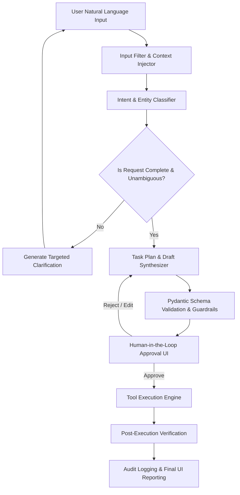

# Agent Design & Cognitive Architecture Specification
## Autonomous AI Agent for Enterprise Task Automation

**Document Version:** 1.0.0  
**Status:** Approved  
**Pattern:** ReAct (Reasoning + Action) + Plan-and-Solve + HITL Guardrails  

---

## 1. Cognitive Architecture Overview

The agent is designed around a hybrid cognitive model combining **Plan-and-Solve Decomposition**, **ReAct (Reasoning + Acting) execution loops**, and **Deterministic Human-in-the-Loop (HITL) verification gates**.



---

## 2. Structured Output Data Models (Pydantic Schemas)

All cognitive steps emit strictly typed objects rather than unstructured strings.

```python
from pydantic import BaseModel, Field, EmailStr
from typing import Optional, List, Dict, Any
from enum import Enum

class TaskType(str, Enum):
    EMAIL_SEND = "EMAIL_SEND"
    EMAIL_DRAFT = "EMAIL_DRAFT"
    DOCUMENT_CREATE = "DOCUMENT_CREATE"
    CALENDAR_SCHEDULE = "CALENDAR_SCHEDULE"
    UNKNOWN = "UNKNOWN"

class EmailPriority(str, Enum):
    LOW = "low"
    NORMAL = "normal"
    HIGH = "high"

class EmailTone(str, Enum):
    FORMAL = "formal"
    PROFESSIONAL = "professional"
    URGENT = "urgent"
    CASUAL = "casual"

class EmailDraftPayload(BaseModel):
    recipient_email: EmailStr = Field(..., description="Target email address (validated format)")
    recipient_name: Optional[str] = Field(None, description="Name or title of recipient")
    subject: str = Field(..., min_length=3, max_length=150, description="Clear, concise subject line")
    body_text: str = Field(..., min_length=10, description="Structured plain-text message")
    body_html: Optional[str] = Field(None, description="HTML formatted version")
    tone: EmailTone = Field(default=EmailTone.PROFESSIONAL)
    priority: EmailPriority = Field(default=EmailPriority.NORMAL)

class ClarificationRequest(BaseModel):
    missing_fields: List[str] = Field(..., description="List of missing parameters e.g., ['recipient_email']")
    question_for_user: str = Field(..., description="Conversational question to ask the user")
    suggested_defaults: Optional[Dict[str, Any]] = None

class TaskPlan(BaseModel):
    task_id: str = Field(..., description="Unique UUID for this task")
    task_type: TaskType
    intent_summary: str = Field(..., description="High-level description of user intent")
    confidence: float = Field(..., ge=0.0, le=1.0)
    requires_clarification: bool = False
    clarification: Optional[ClarificationRequest] = None
    target_tool: str = Field(..., description="Identifier of tool from registry, e.g. 'gmail_send_tool'")
    tool_parameters: Dict[str, Any] = Field(default_factory=dict)
```

---

## 3. System Prompts & Cognitive Instructions

### 3.1 Master System Prompt (`SYSTEM_PROMPT_AGENT_CORE`)

```text
You are an Autonomous Enterprise Task Automation Assistant.
Your mission is to understand user instructions, extract precise actionable parameters,
generate high-quality professional enterprise drafts, and construct structured execution plans.

OPERATIONAL RULES:
1. ALWAYS respond with valid JSON matching the requested schema.
2. NEVER assume or invent email addresses. If the user mentions a role (e.g. "my guide") without an email, mark 'requires_clarification=true' and specify 'missing_fields': ['recipient_email'].
3. Maintain an empathetic, professional, and concise tone appropriate for enterprise communication.
4. When drafting emails, ensure appropriate salutation, body paragraphs with clear call-to-action, and professional sign-off.
5. Identify any potential ambiguities or risks and request explicit confirmation.
```

### 3.2 Dynamic Few-Shot Examples Injected into Prompt

#### Example 1: Full Information Provided
- **Input:** *"Send an email to dr.sharma@university.edu informing him that our BTech Major Project Phase 1 is complete and we would like to schedule a review on Friday at 3 PM."*
- **Structured Plan:**
  - `task_type`: `"EMAIL_SEND"`
  - `requires_clarification`: `false`
  - `target_tool`: `"gmail_send_tool"`
  - `tool_parameters`:
    - `recipient_email`: `"dr.sharma@university.edu"`
    - `recipient_name`: `"Dr. Sharma"`
    - `subject`: `"Project Phase 1 Completion & Review Meeting Request"`
    - `body_text`: `"Dear Dr. Sharma,\n\nI hope this email finds you well.\n\nOur team has completed Phase 1 of our Major Project. We would appreciate the opportunity to present our progress and request a review session with you this Friday at 3:00 PM.\n\nPlease let us know if this time works for you or if you prefer an alternative slot.\n\nBest regards,\nProject Team"`

#### Example 2: Missing Recipient Email
- **Input:** *"Send an email to the client telling them the invoice is ready."*
- **Structured Plan:**
  - `task_type`: `"EMAIL_SEND"`
  - `requires_clarification`: `true`
  - `clarification`:
    - `missing_fields`: `["recipient_email"]`
    - `question_for_user`: *"Could you please provide the recipient's email address for the client?"*

---

## 4. Context & Memory Management

The agent maintains two tiers of context:

1. **Short-Term Session Memory:**
   - Tracks the active multi-turn dialogue within a session.
   - Stores user corrections and clarification responses.
   - Resets when a new task is initiated or explicitly cleared.

2. **Execution & Tool History:**
   - Maintains an immutable timeline of executed steps, tool results, API response IDs, and user approval timestamps.
   - Used for generating audit reports and supporting multi-step chained tasks.

---

## 5. Self-Correction & Reasoning Loop

When an LLM generates a malformed response or Pydantic validation fails:
1. The error details (validation trace) are appended to a self-correction prompt.
2. The agent re-invokes the reasoning model with a temperature adjustment ($\Delta T = -0.1$).
3. If validation fails after 2 attempts, the system falls back to a graceful clarification UI rather than crashing.
