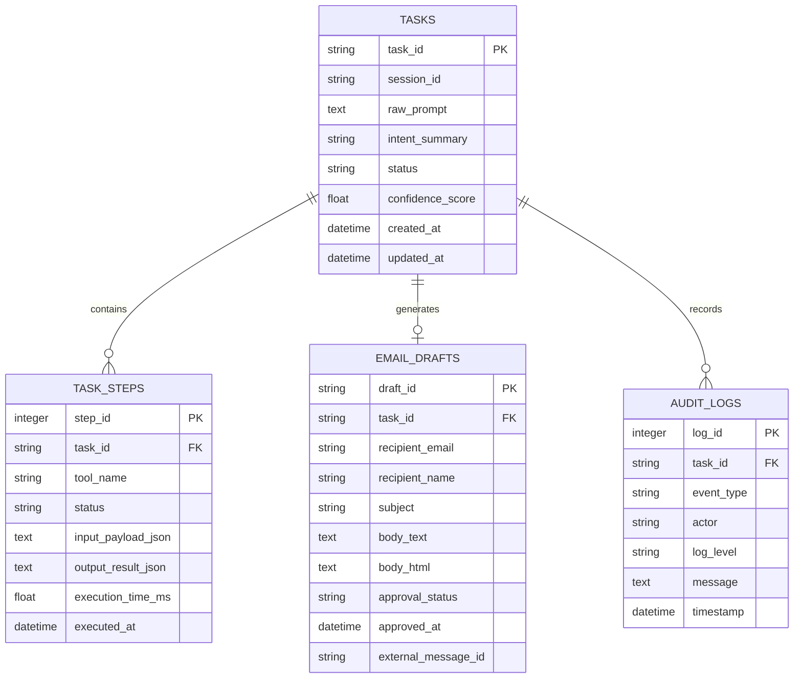

# Database & Persistence Specification
## Autonomous AI Agent for Enterprise Task Automation

**Document Version:** 1.0.0  
**Status:** Approved  
**Storage Engine:** SQLite 3 with SQLAlchemy 2.0 ORM  

---

## 1. Storage Architecture Overview

The system uses an embedded, zero-configuration, ACID-compliant **SQLite 3** relational database to persist session state, task execution plans, approval records, generated drafts, and audit telemetry.



---

## 2. Relational Schema DDL Specification

```sql
-- 1. Tasks / Workflows Table
CREATE TABLE IF NOT EXISTS tasks (
    task_id VARCHAR(36) PRIMARY KEY,
    session_id VARCHAR(64) NOT NULL,
    raw_prompt TEXT NOT NULL,
    intent_summary VARCHAR(255),
    status VARCHAR(32) NOT NULL DEFAULT 'IDLE',
    confidence_score REAL DEFAULT 0.0,
    created_at TIMESTAMP DEFAULT CURRENT_TIMESTAMP,
    updated_at TIMESTAMP DEFAULT CURRENT_TIMESTAMP
);

CREATE INDEX idx_tasks_session ON tasks(session_id);
CREATE INDEX idx_tasks_status ON tasks(status);

-- 2. Task Steps Table
CREATE TABLE IF NOT EXISTS task_steps (
    step_id INTEGER PRIMARY KEY AUTOINCREMENT,
    task_id VARCHAR(36) NOT NULL,
    tool_name VARCHAR(64) NOT NULL,
    status VARCHAR(32) NOT NULL,
    input_payload_json TEXT,
    output_result_json TEXT,
    execution_time_ms REAL DEFAULT 0.0,
    executed_at TIMESTAMP DEFAULT CURRENT_TIMESTAMP,
    FOREIGN KEY (task_id) REFERENCES tasks(task_id) ON DELETE CASCADE
);

CREATE INDEX idx_steps_task ON task_steps(task_id);

-- 3. Email Drafts Table
CREATE TABLE IF NOT EXISTS email_drafts (
    draft_id VARCHAR(36) PRIMARY KEY,
    task_id VARCHAR(36) NOT NULL UNIQUE,
    recipient_email VARCHAR(255) NOT NULL,
    recipient_name VARCHAR(128),
    subject VARCHAR(255) NOT NULL,
    body_text TEXT NOT NULL,
    body_html TEXT,
    approval_status VARCHAR(32) DEFAULT 'PENDING',
    approved_at TIMESTAMP NULL,
    external_message_id VARCHAR(128) NULL,
    FOREIGN KEY (task_id) REFERENCES tasks(task_id) ON DELETE CASCADE
);

CREATE INDEX idx_drafts_recipient ON email_drafts(recipient_email);

-- 4. Audit Logs Table
CREATE TABLE IF NOT EXISTS audit_logs (
    log_id INTEGER PRIMARY KEY AUTOINCREMENT,
    task_id VARCHAR(36) NULL,
    event_type VARCHAR(64) NOT NULL,
    actor VARCHAR(64) DEFAULT 'SYSTEM',
    log_level VARCHAR(16) DEFAULT 'INFO',
    message TEXT NOT NULL,
    timestamp TIMESTAMP DEFAULT CURRENT_TIMESTAMP,
    FOREIGN KEY (task_id) REFERENCES tasks(task_id) ON DELETE SET NULL
);

CREATE INDEX idx_audit_task ON audit_logs(task_id);
CREATE INDEX idx_audit_timestamp ON audit_logs(timestamp);
```

---

## 3. SQLAlchemy 2.0 ORM Implementation

```python
from datetime import datetime
from typing import Optional, List
from sqlalchemy import String, Text, Float, DateTime, ForeignKey, Integer, func
from sqlalchemy.orm import DeclarativeBase, Mapped, mapped_column, relationship

class Base(DeclarativeBase):
    pass

class TaskModel(Base):
    __tablename__ = "tasks"

    task_id: Mapped[str] = mapped_column(String(36), primary_key=True)
    session_id: Mapped[str] = mapped_column(String(64), nullable=False)
    raw_prompt: Mapped[str] = mapped_column(Text, nullable=False)
    intent_summary: Mapped[Optional[str]] = mapped_column(String(255))
    status: Mapped[str] = mapped_column(String(32), default="IDLE")
    confidence_score: Mapped[float] = mapped_column(Float, default=0.0)
    created_at: Mapped[datetime] = mapped_column(DateTime, server_default=func.now())
    updated_at: Mapped[datetime] = mapped_column(DateTime, server_default=func.now(), onupdate=func.now())

    steps: Mapped[List["TaskStepModel"]] = relationship("TaskStepModel", back_populates="task", cascade="all, delete-orphan")
    draft: Mapped[Optional["EmailDraftModel"]] = relationship("EmailDraftModel", back_populates="task", uselist=False, cascade="all, delete-orphan")
    audit_logs: Mapped[List["AuditLogModel"]] = relationship("AuditLogModel", back_populates="task")

class TaskStepModel(Base):
    __tablename__ = "task_steps"

    step_id: Mapped[int] = mapped_column(Integer, primary_key=True, autoincrement=True)
    task_id: Mapped[str] = mapped_column(String(36), ForeignKey("tasks.task_id"))
    tool_name: Mapped[str] = mapped_column(String(64))
    status: Mapped[str] = mapped_column(String(32))
    input_payload_json: Mapped[Optional[str]] = mapped_column(Text)
    output_result_json: Mapped[Optional[str]] = mapped_column(Text)
    execution_time_ms: Mapped[float] = mapped_column(Float, default=0.0)
    executed_at: Mapped[datetime] = mapped_column(DateTime, server_default=func.now())

    task: Mapped["TaskModel"] = relationship("TaskModel", back_populates="steps")

class EmailDraftModel(Base):
    __tablename__ = "email_drafts"

    draft_id: Mapped[str] = mapped_column(String(36), primary_key=True)
    task_id: Mapped[str] = mapped_column(String(36), ForeignKey("tasks.task_id"), unique=True)
    recipient_email: Mapped[str] = mapped_column(String(255))
    recipient_name: Mapped[Optional[str]] = mapped_column(String(128))
    subject: Mapped[str] = mapped_column(String(255))
    body_text: Mapped[str] = mapped_column(Text)
    body_html: Mapped[Optional[str]] = mapped_column(Text)
    approval_status: Mapped[str] = mapped_column(String(32), default="PENDING")
    approved_at: Mapped[Optional[datetime]] = mapped_column(DateTime, nullable=True)
    external_message_id: Mapped[Optional[str]] = mapped_column(String(128), nullable=True)

    task: Mapped["TaskModel"] = relationship("TaskModel", back_populates="draft")

class AuditLogModel(Base):
    __tablename__ = "audit_logs"

    log_id: Mapped[int] = mapped_column(Integer, primary_key=True, autoincrement=True)
    task_id: Mapped[Optional[str]] = mapped_column(String(36), ForeignKey("tasks.task_id"), nullable=True)
    event_type: Mapped[str] = mapped_column(String(64))
    actor: Mapped[str] = mapped_column(String(64), default="SYSTEM")
    log_level: Mapped[str] = mapped_column(String(16), default="INFO")
    message: Mapped[str] = mapped_column(Text)
    timestamp: Mapped[datetime] = mapped_column(DateTime, server_default=func.now())

    task: Mapped[Optional["TaskModel"]] = relationship("TaskModel", back_populates="audit_logs")
```

---

## 4. Data Privacy, Retention & Sanitization Policy

1. **Token Isolation:** Access and refresh tokens are **never** stored in the SQLite database. They are isolated in encrypted local credential caches (`token.json`).
2. **Payload Redaction:** Any input payloads containing sensitive credentials or tokens are scrubbed using regular expressions before writing `input_payload_json` or `message`.
3. **Retention Period:** SQLite database files default to retaining execution history for 90 days. A cleanup script `python -m db.cleanup --older-than 90d` is provided.
