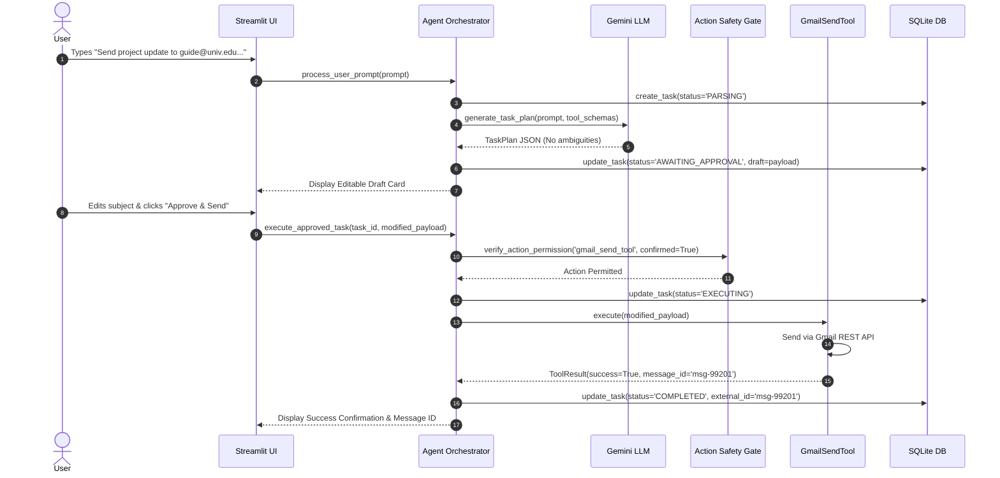
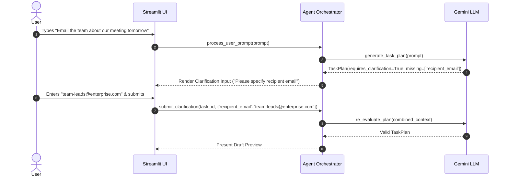
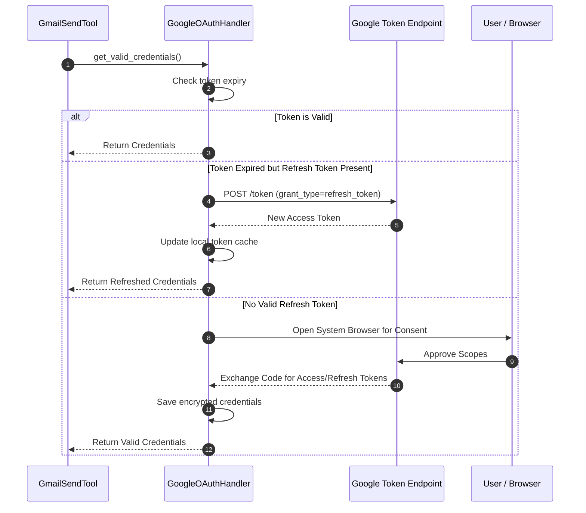

# Workflow & State Machine Specification
## Autonomous AI Agent for Enterprise Task Automation

**Document Version:** 1.0.0  
**Status:** Approved  
**Execution Model:** Deterministic Finite State Machine (FSM)  

---

## 1. End-to-End Workflow Sequences

### 1.1 Workflow 1: Standard Execution (Happy Path)

---

### 1.2 Workflow 2: Ambiguous / Incomplete Parameter Flow

---

### 1.3 Workflow 3: OAuth Token Refresh & Re-Authentication Flow

---

## 2. State Transition Matrix

The table below enforces legal state transitions across the application lifecycle:

| Current State | Trigger Event | Guard Condition | Next State | Actions Executed |
|---|---|---|---|---|
| `IDLE` | `SUBMIT_PROMPT` | Prompt length $> 5$ chars | `PARSING` | Initialize `TaskRecord` in DB; record start timestamp. |
| `PARSING` | `PLAN_GENERATED` | Schema valid, no missing fields | `AWAITING_APPROVAL` | Save draft in DB; render interactive UI draft card. |
| `PARSING` | `MISSING_FIELDS` | Confidence $< 0.7$ or missing email | `CLARIFICATION` | Render question prompt in UI; pause execution. |
| `CLARIFICATION` | `SUBMIT_INFO` | Required fields provided | `PARSING` | Append info to prompt context; re-invoke LLM. |
| `AWAITING_APPROVAL` | `CLICK_APPROVE` | User confirms; payload valid | `EXECUTING` | Lock draft; check tool permissions; invoke tool. |
| `AWAITING_APPROVAL` | `CLICK_CANCEL` | User clicks cancel button | `CANCELLED` | Record cancellation in DB; clean UI state. |
| `EXECUTING` | `API_SUCCESS` | External API returns HTTP 200 | `COMPLETED` | Store external message ID; display success alert. |
| `EXECUTING` | `API_ERROR` | Retries exhausted / 4xx/5xx | `FAILED` | Capture error message; log audit failure; alert user. |
| `COMPLETED` / `FAILED` / `CANCELLED` | `RESET_TASK` | None | `IDLE` | Reset session state for new workflow. |

---

## 3. Workflow Telemetry & Metrics Hooks

Every state change triggers an asynchronous telemetry hook recording:
- `task_id`: UUID
- `from_state` $\rightarrow$ `to_state`
- `latency_ms`: Duration spent in previous state
- `metadata`: Tool name, retry count, token consumption (prompt/completion tokens)
