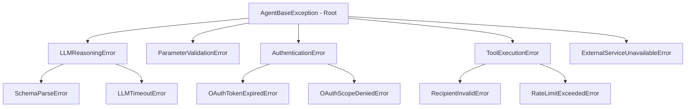

# Fault Tolerance, Error Handling & Recovery Specification
## Autonomous AI Agent for Enterprise Task Automation

**Document Version:** 1.0.0  
**Status:** Approved  
**Pattern:** Typed Exception Hierarchy + Graceful Degradation  

---

## 1. Exception Hierarchy & Taxonomy

All system exceptions inherit from a root `AgentBaseException`, providing structured error codes, user-facing explanations, and recovery recommendations:



---

## 2. Typed Exception Implementation

```python
class AgentBaseException(Exception):
    """Base class for all application domain exceptions."""
    def __init__(self, message: str, user_message: str, error_code: str, recoverable: bool = True):
        super().__init__(message)
        self.message = message
        self.user_message = user_message
        self.error_code = error_code
        self.recoverable = recoverable

class ParameterValidationError(AgentBaseException):
    def __init__(self, message: str, missing_fields: list = None):
        super().__init__(
            message=message,
            user_message="Some required information is missing or formatted incorrectly.",
            error_code="ERR_PARAM_VALIDATION",
            recoverable=True
        )
        self.missing_fields = missing_fields or []

class AuthenticationError(AgentBaseException):
    def __init__(self, message: str):
        super().__init__(
            message=message,
            user_message="Google Gmail authentication failed. Please reconnect your account.",
            error_code="ERR_AUTH_FAILURE",
            recoverable=True
        )

class ToolExecutionError(AgentBaseException):
    def __init__(self, message: str, tool_name: str):
        super().__init__(
            message=message,
            user_message=f"Failed to execute task on {tool_name}. Please verify parameters and retry.",
            error_code="ERR_TOOL_EXECUTION",
            recoverable=True
        )
        self.tool_name = tool_name
```

---

## 3. Comprehensive Error Handling & Recovery Matrix

| Scenario | Root Cause | System Detection | User-Facing Actionable Alert | Automatic Recovery Policy |
|---|---|---|---|---|
| **Invalid Email Address** | User entered typo (e.g. `user@com`) | Pydantic `EmailStr` regex validation failure | *"The email address 'user@com' is invalid. Please provide a valid address."* | Returns to clarification/editing UI. |
| **Missing Parameters** | Request lacked recipient or content | LLM parser flags `missing_fields` | *"Who would you like to send this email to?"* | Renders targeted text box in UI. |
| **LLM Output Malformed** | Model returned invalid JSON | `json.loads` or Pydantic parse error | *"Drafting task... refining parameters."* | Automatic retry with error feedback (up to 2 times). |
| **OAuth Token Expired** | Access token exceeded 1 hr validity | Google API returns 401 Unauthorized | Silent background refresh | Auto-refresh via refresh token; if fails, prompt user to re-authorize. |
| **Rate Limit Hit (429)** | Exceeded Google API or Gemini rate | HTTP 429 Status Code | *"Service is busy, retrying in a moment..."* | Exponential backoff ($1s, 2s, 4s, 8s$) with jitter. |
| **Network Timeout** | Internet drop during API send | `requests.exceptions.Timeout` | *"Connection timed out while reaching Gmail servers. Your draft is saved."* | Mark task `FAILED_RETRYABLE`; offer 1-click retry button. |
| **Unsupported Task Request** | User asks for something out of scope | LLM classifies `TaskType.UNKNOWN` | *"This system currently supports Email Automation. Document and Calendar tools are coming soon."* | Graceful decline; return to `IDLE`. |

---

## 4. User Error Messaging Guidelines

1. **Never Show Raw Python Stack Traces:** Stack traces contain sensitive file paths, library internals, and confuse users. Always map to `user_message`.
2. **Always Provide Clear Next Steps:** An error message must tell the user what went wrong, whether their work is saved, and what button to click next.
3. **Preserve User Inputs on Failure:** If an execution fails, the user's drafted email text is never cleared; it remains editable in the UI.
