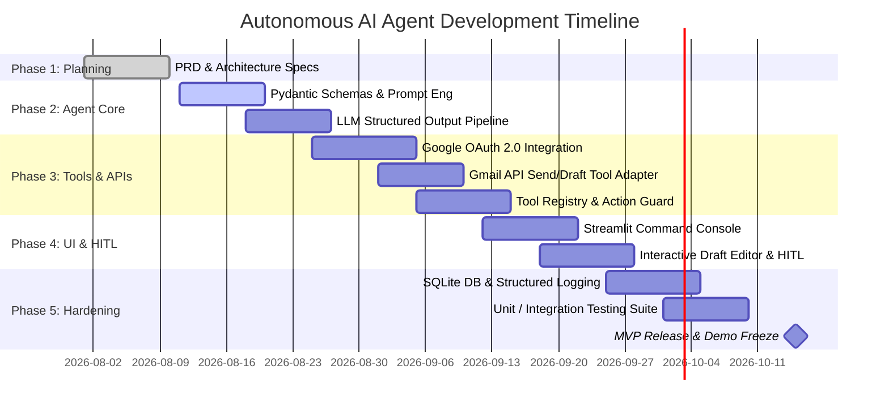

# Development Roadmap & Milestone Specification
## Autonomous AI Agent for Enterprise Task Automation

**Document Version:** 1.0.0  
**Status:** Approved  
**Timeline:** 10 Weeks (MVP) + Future Enterprise Horizons  

---

## 1. Project Timeline & Phase Breakdown



---

## 2. Phase-by-Phase Deliverables & Definition of Done (DoD)

### Phase 1: Research, Architecture & Specification (Weeks 1 - 2) [COMPLETED]
- [x] Comprehensive PRD approved.
- [x] Hexagonal system architecture, tool registry patterns, and database schemas drafted.
- [x] Team workload allocated across AI, Backend, and Frontend modules.

### Phase 2: Core Agent Engine & Prompt Infrastructure (Weeks 3 - 4)
- **Deliverables:**
  - Pydantic models for `TaskPlan`, `EmailDraftPayload`, `ClarificationRequest`.
  - Master System Prompt with structured few-shot examples.
  - Gemini LLM adapter supporting strict JSON output formatting.
- **Definition of Done:** Agent parses free-form text input into valid `TaskPlan` JSON with $\ge 95\%$ accuracy on benchmark prompts.

### Phase 3: Gmail Integration & Tool Execution Layer (Weeks 5 - 6)
- **Deliverables:**
  - `GoogleOAuthHandler` supporting web and local loopback authorization.
  - `GmailClient` and `GmailSendTool` implementing MIME creation and message dispatch.
  - `ToolRegistry` and `ActionGuard` enforcing permission checks.
- **Definition of Done:** End-to-end programmatic dispatch of emails via Gmail API with valid Message ID returned.

### Phase 4: Streamlit Frontend & Human-in-the-Loop Interface (Weeks 7 - 8)
- **Deliverables:**
  - Streamlit dashboard with sidebar status and history drawer.
  - Interactive Draft Preview Card allowing live editing before approval.
  - Execution timeline and color-coded status badges.
- **Definition of Done:** User can input a task, review the synthesized draft, edit text in-browser, and approve sending with one click.

### Phase 5: Reliability, Security Hardening & Evaluation (Weeks 9 - 10)
- **Deliverables:**
  - SQLite database integration for task persistence and audit history.
  - Loguru structured JSON logging with PII/token scrubber.
  - Complete automated test suite (`pytest`) achieving $\ge 85\%$ test coverage.
- **Definition of Done:** Production-ready MVP demo capable of handling edge cases, token expiration, and network interruptions gracefully.

---

## 3. Post-MVP Enterprise Roadmap

```text
+-----------------------------------------------------------------------------------+
| MVP (Current)    | Intelligent Natural Language Email Automation via Gmail API    |
+------------------+----------------------------------------------------------------+
| V1.0 (Month 3)   | Document Automation (Word .docx generation, templates)        |
+------------------+----------------------------------------------------------------+
| V2.0 (Month 5)   | Smart PDF Operations (Report summarization, table extraction)  |
+------------------+----------------------------------------------------------------+
| V3.0 (Month 7)   | Calendar & Scheduling (Conflict resolution, invite automation) |
+------------------+----------------------------------------------------------------+
| V4.0 (Month 9)   | Multi-Agent Orchestration & Enterprise Single-Sign-On (SSO)   |
+-----------------------------------------------------------------------------------+
```
