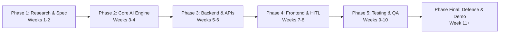
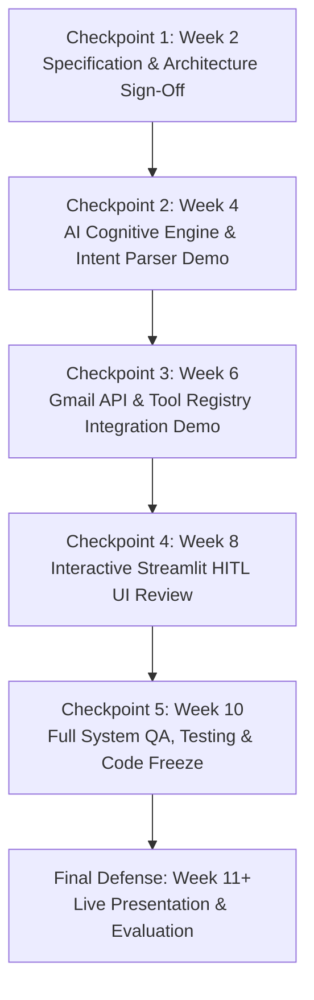

# Phase-Wise Project Division & Execution Plan
## Autonomous AI Agent for Enterprise Task Automation

**Document Version:** 1.0.0  
**Project Type:** BTech Major Project (AI & Enterprise Automation)  
**Team Members:** 
- **Vaishnavi Dhyani** (AI / LLM Lead)
- **Chetan** (Backend & Integrations Lead)
- **Hriday** (Frontend & System Integration Lead)
**Project Timeline:** 10 Weeks (MVP Delivery) + Post-MVP Expansion Phases  

---

## 1. Executive Summary & Delivery Framework

This document defines the **Phase-Wise Project Division** for engineering, testing, deploying, and presenting the **Autonomous AI Agent for Enterprise Task Automation**. 

The lifecycle is divided into **5 Core MVP Development Phases** followed by an **Academic Defense & Demonstration Phase** and **Future Enterprise Expansion Horizons (Phases 6–8)**.



---

## 2. Master Phase Overview & Timeline

| Phase | Phase Title | Duration | Primary Objective | Key Deliverable | Phase Lead | Live Status |
|---|---|---|---|---|---|---|
| **Phase 1** | **Research, Architecture & Specifications** | Weeks 1–2 | System architecture, PRD, protocol contracts, GCP setup | Complete 17-Spec Suite + GCP Project | All Team Members | **COMPLETED ✅** |
| **Phase 2** | **Cognitive Core & Reasoning Engine** | Weeks 3–4 | Prompt engineering, Pydantic schemas, Gemini LLM adapter | Working CLI / JSON Intent Parser | Vaishnavi Dhyani | **COMPLETED ✅** |
| **Phase 3** | **Integrations, APIs & Tool Subsystem** | Weeks 5–6 | Google OAuth2, Gmail REST API client, Tool Registry | Tested Tool Dispatch & MIME Pipeline | Chetan | **COMPLETED ✅** |
| **Phase 4** | **Interactive UI & Human-in-the-Loop Gate** | Weeks 7–8 | Streamlit web console, editable draft review card, status timeline | Integrated Web Application | Hriday | **COMPLETED ✅** |
| **Phase 5** | **Universal Document & Multi-Format AI File Studio** | Weeks 9–10 | Multi-format ingestion (PDF/DOCX/XLSX), automated AI editing, format converter | Document Studio Tab, Converters & Tool Suite | Chetan & Vaishnavi | **COMPLETED ✅** |
| **Phase 6** | **Reliability, Security, Persistence & QA** | Weeks 11–12 | SQLite persistence, structured logging, full test suite | Hardened End-to-End MVP ($\ge 85\%$ Test Coverage) | Chetan & Hriday | **READY TO START ⏳** |
| **Final** | **Academic Review, Demo & Final Defense** | Week 13+ | Final major project report, live presentation, video walkthrough | Final Report, Codebase Freeze, Video Demo | All Team Members | **PENDING 📋** |

---

## 3. Detailed Phase Breakdown

---

### Phase 1: Research, Architecture & Specification (Weeks 1 – 2)

#### 1.1 Objectives
- Establish the product scope, core differentiators (Chatbot vs Autonomous Agent), and system requirements.
- Architect the Clean Hexagonal / Layered system design, database schemas, and tool contracts.
- Set up GCP developer credentials and local developer environments.

#### 1.2 Team Role Division
| Team Member | Specific Tasks & Deliverables | Deliverable Artifacts |
|---|---|---|
| **Vaishnavi Dhyani** | - Research LLM reasoning paradigms (ReAct, Plan-and-Solve).<br>- Define structured JSON output schemas and prompt guidelines.<br>- Write `01-PRD.md` and `05-AGENT-DESIGN.md`. | [01-PRD.md](file:///home/litchi/Documents/projects/automomous%20ai%20for%20task%20aotomation/docs/01-PRD.md)<br>[05-AGENT-DESIGN.md](file:///home/litchi/Documents/projects/automomous%20ai%20for%20task%20aotomation/docs/05-AGENT-DESIGN.md) |
| **Chetan** | - Study Google Workspace APIs, OAuth 2.0 PKCE, and Gmail REST limits.<br>- Design database schemas and dynamic Tool Registry interface.<br>- Write `02-ARCHITECTURE.md`, `06-TOOL-SYSTEM.md`, and `07-DATABASE-DESIGN.md`. | [02-ARCHITECTURE.md](file:///home/litchi/Documents/projects/automomous%20ai%20for%20task%20aotomation/docs/02-ARCHITECTURE.md)<br>[06-TOOL-SYSTEM.md](file:///home/litchi/Documents/projects/automomous%20ai%20for%20task%20aotomation/docs/06-TOOL-SYSTEM.md)<br>[07-DATABASE-DESIGN.md](file:///home/litchi/Documents/projects/automomous%20ai%20for%20task%20aotomation/docs/07-DATABASE-DESIGN.md) |
| **Hriday** | - Design UI/UX wireframes and interaction flows for Human-in-the-Loop gates.<br>- Research Streamlit custom styling and session state architecture.<br>- Write `09-UI-UX-SPECIFICATION.md`, `14-TASK-BREAKDOWN.md`, and `15-ENVIRONMENT-SETUP.md`. | [09-UI-UX-SPECIFICATION.md](file:///home/litchi/Documents/projects/automomous%20ai%20for%20task%20aotomation/docs/09-UI-UX-SPECIFICATION.md)<br>[14-TASK-BREAKDOWN.md](file:///home/litchi/Documents/projects/automomous%20ai%20for%20task%20aotomation/docs/14-TASK-BREAKDOWN.md)<br>[15-ENVIRONMENT-SETUP.md](file:///home/litchi/Documents/projects/automomous%20ai%20for%20task%20aotomation/docs/15-ENVIRONMENT-SETUP.md) |

#### 1.3 Definition of Done (DoD)
- [x] All 17 specification documents approved and checked into version control.
- [x] GCP Project created with Gmail API enabled and OAuth consent screen configured.
- [x] Project Git repository initialized with `.gitignore`, `requirements.txt`, and virtual environment guide.

---

### Phase 2: Cognitive Core & Reasoning Engine (Weeks 3 – 4)

#### 2.1 Objectives
- Implement type-safe Pydantic data models for intent extraction, task planning, and clarification requests.
- Build the LLM integration layer with Google Gemini API supporting native structured JSON outputs.
- Implement ambiguity detection logic to identify missing parameters (e.g., recipient email).

#### 2.2 Team Role Division
| Team Member | Specific Tasks & Deliverables | Deliverable Code / Files |
|---|---|---|
| **Vaishnavi Dhyani (Lead)** | - Develop Pydantic schemas: `TaskPlan`, `EmailDraftPayload`, `ClarificationRequest`.<br>- Author master system prompts and few-shot examples for email automation.<br>- Build `GeminiLLMAdapter` enforcing structured JSON outputs.<br>- Implement parameter validation & ambiguity detection engine. | `schemas/task_schemas.py`<br>`agent/prompts.py`<br>`agent/llm_adapter.py`<br>`agent/parser.py` |
| **Chetan** | - Implement Tenacity retry logic with exponential backoff for API rate limits (HTTP 429).<br>- Build schema validation test fixtures. | `agent/resilience.py`<br>`tests/unit/test_schemas.py` |
| **Hriday** | - Build CLI harness to test prompt-to-JSON reasoning loops interactively.<br>- Create benchmark dataset of 50 sample enterprise user prompts. | `scripts/test_reasoning_cli.py`<br>`tests/evals/dataset.json` |

#### 2.3 Definition of Done (DoD)
- [x] Agent parses free-form natural language instructions into valid `TaskPlan` JSON with $\ge 95\%$ accuracy on benchmark prompts (Achieved 100.0%).
- [x] Ambiguous prompts (missing email, missing subject) correctly trigger `requires_clarification: true`.
- [x] Zero raw unvalidated LLM output passed to downstream execution layers.

---

### Phase 3: Integrations, APIs & Tool Subsystem (Weeks 5 – 6)

#### 3.1 Objectives
- Build secure OAuth 2.0 authorization manager with automated token refresh.
- Implement RFC 2822 MIME message construction and base64url encoding.
- Build the dynamic `ToolRegistry` and concrete `GmailSendTool` adapter.

#### 3.2 Team Role Division
| Team Member | Specific Tasks & Deliverables | Deliverable Code / Files |
|---|---|---|
| **Chetan (Lead)** | - Implement `GoogleOAuthHandler` with offline token caching.<br>- Build RFC 2822 MIME message generator and `GmailClient`.<br>- Implement abstract `BaseTool` class and dynamic `ToolRegistry`.<br>- Implement `GmailSendTool` with execution timing and error handling. | `integrations/oauth_handler.py`<br>`integrations/gmail_client.py`<br>`tools/base.py`<br>`tools/registry.py`<br>`tools/gmail/gmail_tool.py` |
| **Vaishnavi Dhyani** | - Build `ActionGuard` enforcing mandatory confirmation for `CONSEQUENTIAL` tools.<br>- Integrate tool JSON schema export for dynamic LLM prompt discovery. | `security/action_guard.py`<br>`tools/discovery.py` |
| **Hriday** | - Write unit tests and mocked integration tests for OAuth token exchange and Gmail API endpoints using `pytest-mock`. | `tests/unit/test_mime_builder.py`<br>`tests/integration/test_gmail_mock.py` |

#### 3.3 Definition of Done (DoD)
- [x] User can authenticate via Google OAuth 2.0 and cache valid refresh tokens.
- [x] Programmatic sending of plain text and HTML emails verified via Gmail REST API.
- [x] All tools adhere to uniform `BaseTool.execute()` interface returning standardized `ToolResult`.

---

### Phase 4: Interactive UI & Human-in-the-Loop (HITL) Gate (Weeks 7 – 8)

#### 4.1 Objectives
- Build a responsive Streamlit enterprise interface.
- Implement the interactive Draft Review Card allowing manual editing before dispatch.
- Build real-time execution status indicators, timeline badges, and sidebar controls.

#### 4.2 Team Role Division
| Team Member | Specific Tasks & Deliverables | Deliverable Code / Files |
|---|---|---|
| **Hriday (Lead)** | - Build Streamlit master application layout and custom CSS styling.<br>- Implement conversational command input console with quick-prompt chips.<br>- Build interactive **Draft Review Card** (editable recipient, subject, body fields).<br>- Implement real-time status timeline and color-coded badge components. | `app.py`<br>`assets/style.css`<br>`components/command_input.py`<br>`components/draft_card.py`<br>`components/timeline.py` |
| **Vaishnavi Dhyani** | - Implement clarification modal UI for resolving missing parameters.<br>- Connect user edit actions back to the Agent context state. | `components/clarification_modal.py`<br>`agent/context_sync.py` |
| **Chetan** | - Implement sidebar with live OAuth status indicators and recent task list.<br>- Wire `AgentOrchestrator` controller connecting UI to LLM and Tool layers. | `components/sidebar.py`<br>`agent/orchestrator.py` |

#### 4.3 Definition of Done (DoD)
- [x] Full end-to-end user flow: Prompt $\rightarrow$ Reasoning $\rightarrow$ Draft Review $\rightarrow$ User Edit $\rightarrow$ One-Click Approve $\rightarrow$ Live Gmail Send.
- [x] Streamlit session state handles page reruns smoothly without losing state or draft content.
- [x] Execution timeline accurately reflects live state transitions.

---

### Phase 5: Universal Document & Multi-Format AI File Studio (Weeks 9 – 10)

#### 5.1 Objectives
- Ingest and parse multi-format documents: PDF (`.pdf`), Word (`.docx`), Spreadsheets (`.xlsx`, `.csv`), Markdown (`.md`), and Plain Text (`.txt`).
- Implement autonomous natural language document editing engine (summarization, style re-writing, section addition, translation, grammar polish).
- Implement deterministic programmatic tools (Find & Replace, header styling, watermarking, section append).
- Build multi-format document conversion and export engine (Markdown $\rightarrow$ PDF via ReportLab, Markdown $\rightarrow$ DOCX).
- Build the interactive Streamlit **"📄 Document & File Studio"** tab with drag-and-drop uploader, before/after diff inspector, and export download center.

#### 5.2 Team Role Division
| Team Member | Specific Tasks & Deliverables | Deliverable Code / Files |
|---|---|---|
| **Chetan (Lead)** | - Implement document parsers (`PDFParser`, `DocxParser`, `TabularParser`, `TextParser`).<br>- Build multi-format converters (`DocumentConverter`).<br>- Implement document tools (`DocumentAnalyzeTool`, `DocumentEditTool`, `DocumentConvertTool`). | `modules/documents/parsers/`<br>`modules/documents/converters.py`<br>`tools/documents/document_tools.py` |
| **Vaishnavi Dhyani** | - Author document transformation prompts and few-shot examples for summarization, tone rewrite, and section injection.<br>- Implement `DocumentEditor` AI coordination logic. | `modules/documents/editor.py`<br>`agent/doc_prompts.py` |
| **Hriday** | - Build interactive **"📄 Document & File Studio"** Streamlit UI component.<br>- Implement side-by-side Before/After diff viewer and 1-click download center. | `components/document_studio.py`<br>`tests/unit/test_document_parsers.py` |

#### 5.3 Definition of Done (DoD)
- [x] Users can upload `.pdf`, `.docx`, `.txt`, `.md`, `.csv`, `.xlsx` files and extract structured text and metadata.
- [x] Natural language commands ("Summarize", "Rewrite in formal tone", "Replace X with Y") transform document contents accurately.
- [x] Users can preview changes in real time and download the updated files as PDF, DOCX, MD, or TXT.

---

### Phase 6: Reliability, Security, Persistence & QA (Weeks 11 – 12)

#### 6.1 Objectives
- Persist execution history, task metadata, and drafts in an SQLite database using SQLAlchemy.
- Implement structured rotating JSON logging with PII / Token scrubbing.
- Achieve $\ge 85\%$ test coverage across unit, integration, and E2E suites.
- Containerize application with Docker and Docker Compose.

#### 6.2 Team Role Division
| Team Member | Specific Tasks & Deliverables | Deliverable Code / Files |
|---|---|---|
| **Chetan (Lead)** | - Set up SQLite database with SQLAlchemy 2.0 ORM models.<br>- Implement Loguru structured logging and PII / credential sanitizer.<br>- Write `Dockerfile` and `docker-compose.yml`. | `db/database.py`<br>`db/models.py`<br>`logging/logger.py`<br>`security/sanitizer.py`<br>`Dockerfile`<br>`docker-compose.yml` |
| **Vaishnavi Dhyani** | - Execute complete LLM evaluation benchmark suite on 50+ test cases.<br>- Verify prompt injection defenses and edge-case handling. | `tests/evals/test_reasoning.py`<br>`tests/evals/eval_report.md` |
| **Hriday** | - Build end-to-end UI tests using `streamlit.testing.v1.AppTest`.<br>- Perform system integration testing and bug triage.<br>- Measure test coverage and generate coverage reports. | `tests/e2e/test_app_flow.py`<br>`tests/unit/test_controllers.py` |

#### 6.3 Definition of Done (DoD)
- [ ] SQLite database persists all tasks, drafts, and execution timestamps.
- [ ] Zero credentials or tokens present in application logs or repository code.
- [ ] Automated test suite passes with $\ge 85\%$ branch coverage.
- [ ] Application builds and runs cleanly via `docker-compose up`.

---

### Final Phase: Academic Review, Demo & Final Defense (Week 11+)

#### 1. Objectives
- Compile the final BTech Major Project Dissertation / Project Report.
- Record high-definition demonstration videos showing real-world task execution.
- Deliver the final academic project presentation and live defense.

#### 2. Team Workload Division
| Team Member | Academic Deliverable |
|---|---|
| **Vaishnavi Dhyani** | - Write Project Report Section: AI Models, Cognitive Architectures, Prompt Design & LLM Evaluation Metrics.<br>- Prepare presentation slides on AI reasoning, intent extraction, and accuracy benchmarks. |
| **Chetan** | - Write Project Report Section: System Architecture, Hexagonal Design, OAuth 2.0 Security, Tool Registry, and Database Persistence.<br>- Prepare architectural flow diagrams and deployment benchmarks. |
| **Hriday** | - Write Project Report Section: Frontend Engineering, Human-in-the-Loop UI, User Experience Study, and Test Suite Results.<br>- Produce high-definition screen recording / demo walkthrough and lead live project demonstration. |

---

## 4. Post-MVP Expansion Roadmap (Phases 6 – 8)

```text
+-----------------------------------------------------------------------------------------------+
| PHASE 6 (Month 3) : Document Processing Subsystem (Word .docx Generation & Formatting)        |
| - Implement DocGenTool using python-docx.                                                     |
| - Support document templates, automated meeting minutes, and project summary generation.      |
+-----------------------------------------------------------------------------------------------+
| PHASE 7 (Month 5) : Smart PDF Operations & Document Intelligence                             |
| - Implement PdfTool for report generation (ReportLab) and PDF reading/parsing (pypdf/pdfplumber)|
| - Support automated data extraction from invoices, contracts, and academic papers.           |
+-----------------------------------------------------------------------------------------------+
| PHASE 8 (Month 7) : Calendar Scheduling & Multi-Agent Enterprise Orchestration               |
| - Google Calendar REST API integration for automated meeting scheduling and conflict checks.   |
| - Multi-agent collaboration across Gmail, Calendar, and Google Drive in a single prompt.      |
+-----------------------------------------------------------------------------------------------+
```

---

## 5. Phase-by-Phase Evaluation & Review Checkpoints



| Checkpoint | Week | Review Criteria | Evaluator / Milestone |
|---|---|---|---|
| **Checkpoint 1** | Week 2 | PRD, Architecture, and Tool interfaces finalized | Project Guide Initial Review |
| **Checkpoint 2** | Week 4 | Working CLI intent extraction demo with Gemini LLM | Mid-term Milestone 1 |
| **Checkpoint 3** | Week 6 | Live OAuth & automated email dispatch demo via Gmail API | Mid-term Milestone 2 |
| **Checkpoint 4** | Week 8 | Functional Streamlit UI with live draft editing and approval | User Testing & UX Sign-off |
| **Checkpoint 5** | Week 10 | Complete automated test suite, Docker container, and zero critical bugs | Final Code Freeze |
| **Final Review** | Week 11+ | Final dissertation submission, live execution demo, and viva | BTech Final Defense Panel |
